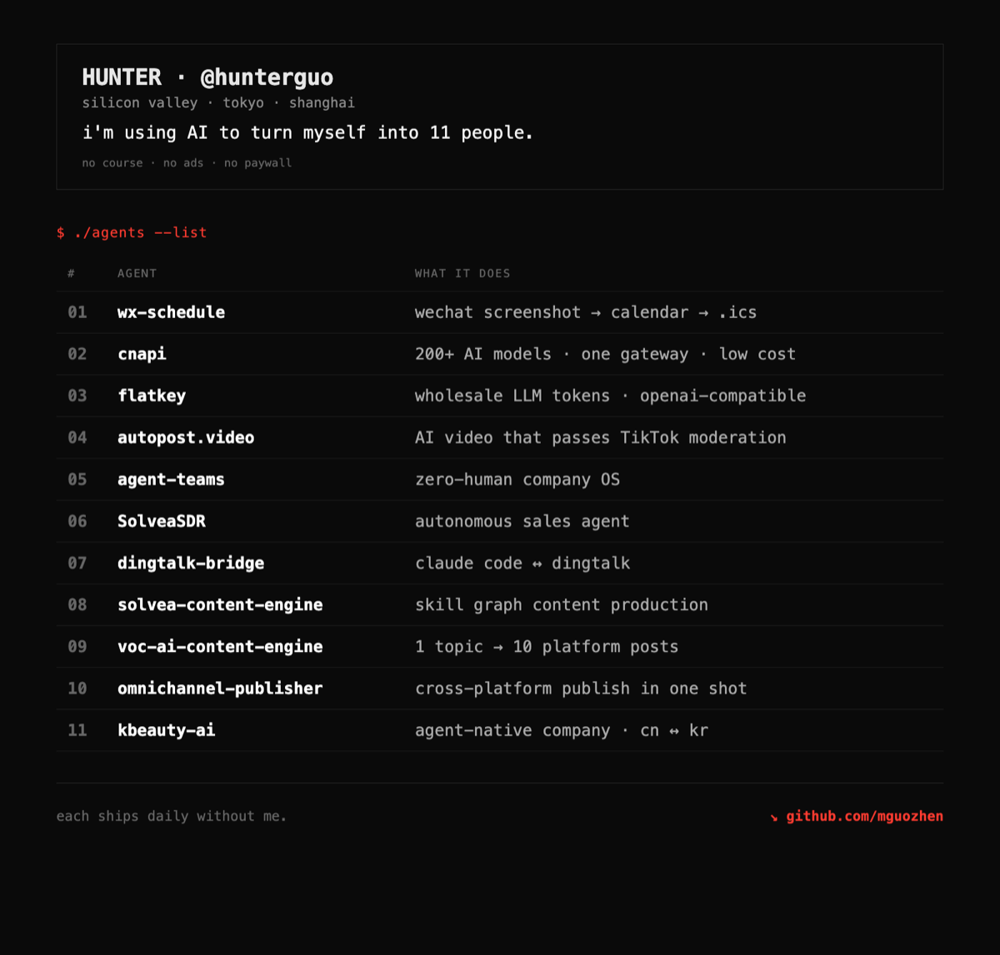
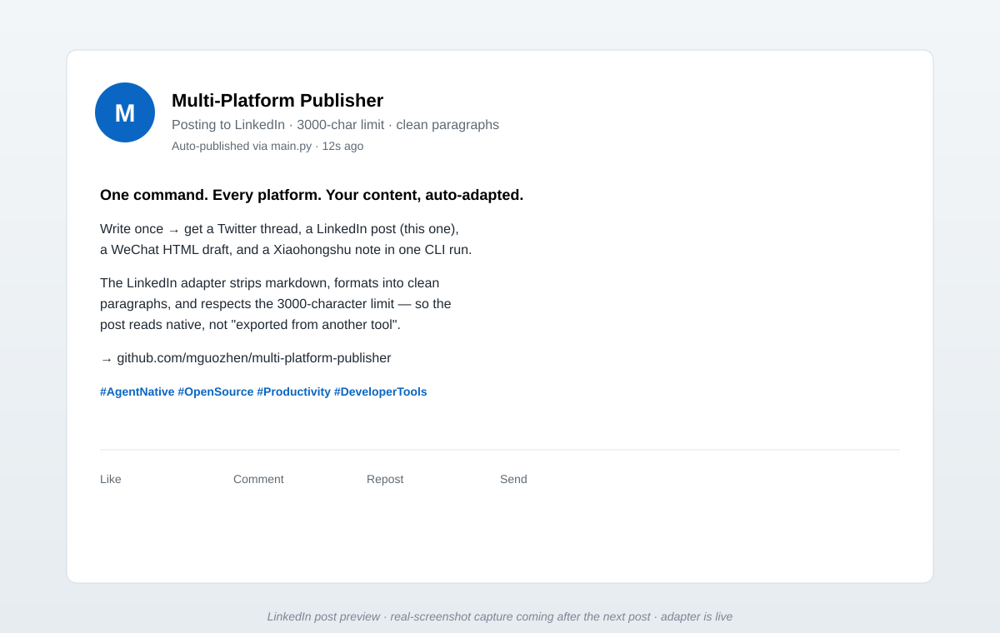

<h1 align="center">Multi-Platform Publisher</h1>

<p align="center">
  <strong>One command. Every platform. Your content, auto-adapted.</strong><br>
  <em>Write once — get a Twitter thread, a LinkedIn post, a WeChat HTML draft, a Xiaohongshu note,<br>
  and a full self-media content pipeline behind it. Agent-native, 13 platforms, MIT.</em>
</p>

<p align="center">
  <a href="#quick-start"></a>
  <a href="#supported-platforms"></a>
  <a href="#mcp-tools"></a>
  <a href="#the-super-writer-pipeline"></a>
  
  <a href="LICENSE"></a>
</p>

<p align="center">
  <a href="docs/screenshots/xhs-cover.png">
    
  </a>
</p>

---

## Per-platform output gallery

The same input piece, reshaped by each adapter — real published assets, not mockups.

### X / Twitter — threads, not the same text

<p align="center">
  <a href="docs/screenshots/twitter-published.png">
    
  </a>
</p>

The Twitter adapter strips markdown, splits at 270 chars with numbering, and chains the post as a thread. Inline images and the original URL are preserved.

---

### LinkedIn — clean paragraphs, 3000-char cap

<p align="center">
  <a href="docs/screenshots/linkedin-placeholder.svg">
    
  </a>
</p>

LinkedIn gets a professional-register rewrite: no markdown artifacts, real paragraph breaks, hashtag block at the end. (Real post screenshot lands here after the next campaign — the adapter is live today.)

---

### WeChat Official Account — HTML draft, never auto-published

<p align="center">
  <a href="docs/screenshots/wechat-published.png">
    
  </a>
</p>

WeChat is **safety-locked to the draft box** — `publish_to_platforms` returns a `draft_id`, never a public URL. You review and tap publish in the Official Account dashboard. The image above is the cover art generated for a real MPP article; the body is rendered as styled HTML by `adapters/wechat_adapter.py`.

---

### Xiaohongshu — emoji, tags, and an 8-slide carousel

<p align="center">
  <a href="docs/screenshots/xhs-cover.png"></a>
  <a href="docs/screenshots/xhs-card-1.png"></a>
  <a href="docs/screenshots/xhs-card-2.png"></a>
  <a href="docs/screenshots/xhs-card-3.png"></a>
</p>
<p align="center">
  <a href="docs/screenshots/xhs-card-4.png"></a>
  <a href="docs/screenshots/xhs-card-5.png"></a>
  <a href="docs/screenshots/xhs-card-6.png"></a>
  <a href="docs/screenshots/xhs-card-7.png"></a>
</p>

Xiaohongshu's native format is image-text with a cover + carousel + 1000-char body. The XHS adapter injects emoji, appends topic tags, and respects the cap. The 8-card set above is the **actual XHS post for `multi-platform-publisher` itself** — published via the same MCP tool you're about to install.

---

## TL;DR

One piece of content in. Thirteen platform-native posts out.

```
                                  ┌───────────────────────────────┐
   ┌──────────────┐               │  content adaptation engine    │
   │  Markdown    │──┐            │  per-platform: length, format, │
   │  or inline   │  │            │  tone, hashtags, threads       │
   └──────────────┘  ├────────────▶───────────────────────────────┤
   ┌──────────────┐  │            │  API adapters   browser auto   │
   │  + images    │──┘            │  X · LinkedIn   HN · Reddit    │
   └──────────────┘               │  WeChat · XHS   note · Substack│
                                  └───────────────┬───────────────┘
                                                  │
        ┌─────────────────────────────────────────┼─────────────────────┐
        ▼                     ▼                   ▼                     ▼
   X / Twitter thread    LinkedIn post     WeChat HTML draft      Xiaohongshu note
   Dev.to · Qiita        YouTube           Hacker News · Reddit   note.com · Substack
```

- **Inputs** — a Markdown file or inline text, optional images
- **Engine** — `utils/content_adapter.py` reshapes per platform (char limits, threads, HTML, emoji, tags)
- **Three surfaces** — an **MCP server** (`python -m mcp_server`), a one-command **CLI** (`main.py`), **and** the **super-writer** content pipeline behind it (topic → AI draft → human review → publish)

---

## Quick start

### Option A — As an MCP server (recommended for Agent use)

```bash
# 1. Install
git clone https://github.com/mguozhen/multi-platform-publisher
cd multi-platform-publisher && pip3 install -r requirements.txt

# 2. Register with your agent (one line)
claude mcp add mpp -- python -m mcp_server

# 3. Set credentials for the platforms you want (env or ~/.openclaw/openclaw.json)
export TWITTER_API_KEY="..."   LINKEDIN_ACCESS_TOKEN="..."
export WECHAT_APPID="..."      XHS_COOKIE="..."
```

Then in any MCP-capable agent:

> Use the `mpp` MCP server to publish `~/post.md` to X and LinkedIn, and preview the WeChat draft first.

The agent calls `adapt_content` (free preview), then `publish_to_platforms`, and returns the per-platform results.

### Option B — One-command CLI

```bash
python3 main.py publish --file article.md --platforms all
python3 main.py publish --content "My post about #AI" --platforms twitter,linkedin
```

### Option C — Preview first (dry run)

```bash
python3 main.py publish --content "My post" --dry-run
```

Shows exactly how the content will be reshaped for each platform — no posting.

### Option D — Utility commands

```bash
python3 main.py list-platforms   # platforms + credential status
python3 main.py validate         # check credentials for every configured platform
```

---

## MCP tools

| # | Tool | Input | When to use |
|---|---|---|---|
| 1 | `publish_to_platforms` | content/file_path, platforms[], images[], dry_run | Default — adapt + publish (or dry-run) to N platforms in one call |
| 2 | `adapt_content` | content/file_path, platform? | Preview the reshape per platform — free, no network |
| 3 | `list_supported_platforms` | (none) | Pre-flight: who is available, with what limits |
| 4 | `validate_credentials` | platform | "Are my keys set?" — no network call |

All tools return JSON-serializable dicts. Errors come back in a structured shape with `type` + `suggested_action` + `retryable` — see [`docs/errors.md`](docs/errors.md).

Capability manifest: [`.well-known/agent-capabilities.json`](.well-known/agent-capabilities.json).

---

## Supported platforms

Two surfaces. The **publisher** (`main.py` + MCP) covers four platforms over official APIs. The **super-writer pipeline** adds nine more through dedicated publishers.

| Platform | Surface | Auth | Output |
|---|---|---|---|
| **X / Twitter** | publisher | OAuth 1.0a | Tweets, threads, image + video upload |
| **LinkedIn** | publisher | OAuth 2.0 | Posts, articles, images |
| **WeChat Official Account** | publisher | API token | HTML article → draft box |
| **Xiaohongshu (小红书)** | publisher | Cookie | Image-text note |
| **Dev.to** | super-writer | REST API | English dev article |
| **Qiita** | super-writer | REST API | Japanese dev article |
| **YouTube** | super-writer | Data API v3 | Video + Shorts |
| **Hacker News** | super-writer | browser automation | Link / text submission |
| **Reddit** | super-writer | browser automation | Subreddit post |
| **note.com** | super-writer | browser automation | Japanese essay |
| **Substack** | super-writer | browser automation | English long-form + Notes |
| **抖音 / Douyin** | super-writer | browser automation | Short video |
| **视频号 / Channels** | super-writer | manual | 1–3 min video |

> Publishing red lines are respected: WeChat stops at the **draft box** (never auto-publishes), Xiaohongshu and Reddit run **human-in-the-loop**, and risky platforms surface a confirmation step. See `super-writer/playbooks/`.

---

## Content adaptation

The same source is reshaped, not just truncated:

- **X / Twitter** — strips Markdown, splits into 270-char tweets, builds numbered threads
- **LinkedIn** — professional register, clean paragraphs, up to 3,000 chars
- **WeChat** — styled HTML article rendered into a draft (manual publish in the dashboard)
- **Xiaohongshu** — casual tone, emoji injection, topic tags, 1,000-char cap
- **Dev.to / Qiita** — front-matter + tags, English / Japanese dev framing
- **Substack / note.com** — long-form essay + short Notes

Each is testable in isolation via `adapt_content(content=..., platform=...)`.

---

## The super-writer pipeline

`super-writer/` is a complete one-person self-media production line:

```
topic gacha  →  AI draft (persona-locked)  →  cover + layout  →  Telegram review  →  multi-platform publish
```

- `super-writer/tools/gacha.py` — topic selector, aggregates 5 sources with scoring
- `super-writer/tools/telegram-bridge/` — human-in-the-loop review bridge + per-platform publishers
- `super-writer/tools/{hn,note,reddit}_publish.py` — browser-automation publishers for API-less platforms
- `super-writer/playbooks/` — 15 platform / content-type writing playbooks
- `super-writer/platform-roadmap.md` — live / queued / manual platform status
- `super-writer/persona.md` — account persona

---

## vs. the alternatives

| | **multi-platform-publisher** | Buffer / Hootsuite | Typefully | Manual posting |
|---|---|---|---|---|
| **Per-platform content adaptation** | ✅ reshapes tone + format | ⚠️ same text everywhere | ⚠️ Twitter-only | ✅ but by hand |
| **Agent-callable (MCP)** | ✅ 4 MCP tools | ❌ | ❌ | ❌ |
| **Dry-run preview** | ✅ `adapt_content` (free) | ⚠️ limited | ✅ Twitter only | n/a |
| **WeChat / Xiaohongshu / Dev.to / Qiita** | ✅ | ❌ | ❌ | ✅ |
| **Content pipeline (topic → draft → review)** | ✅ super-writer | ❌ | ❌ | ❌ |
| **Per-platform failure isolation** | ✅ | ❌ batch fails as one | n/a | n/a |
| **Cost** | free, MIT | $6–99/mo | $12.50/mo | free |
| **Open source** | ✅ | ❌ | ❌ | — |

---

## Architecture

```
multi-platform-publisher/
├── mcp_server.py              # MCP entrypoint — 4 tools (publish, adapt, list, validate)
├── main.py                    # CLI entrypoint + orchestrator
├── adapters/
│   ├── base_adapter.py        # abstract base: publish() / validate() / upload_image()
│   ├── twitter_adapter.py     # X / Twitter — OAuth 1.0a
│   ├── linkedin_adapter.py    # LinkedIn — OAuth 2.0
│   ├── wechat_adapter.py      # WeChat Official Account — API token
│   └── xiaohongshu_adapter.py # Xiaohongshu — cookie
├── utils/
│   ├── config_loader.py       # env > openclaw.json > config.json
│   ├── content_adapter.py     # per-platform content transformation
│   ├── image_handler.py       # resize / validate before upload
│   └── logger.py
├── super-writer/              # one-person self-media content pipeline
│   ├── tools/                 # gacha, telegram-bridge, per-platform publishers
│   ├── playbooks/             # 15 writing playbooks
│   ├── platform-roadmap.md
│   └── persona.md
├── .well-known/
│   └── agent-capabilities.json   # discovery manifest for Agents
├── docs/
│   ├── errors.md              # semantic error code reference
│   ├── screenshots/           # per-platform output gallery (shown above)
│   └── mcp-distribution/      # paste-ready catalog submission package
├── podcasts/                  # sample podcast audio
├── tests/
├── SKILL.md                   # OpenClaw skill definition
└── manifest.json
```

- **Adapters** — each platform isolated behind `BaseAdapter`; adding one is a single file
- **Config precedence** — environment variables > `~/.openclaw/openclaw.json` > local `config.json`
- **Secrets** — never committed; `.env`, cookies, and browser profiles are gitignored

---

## Configuration

Credentials load with this precedence: **env vars → `~/.openclaw/openclaw.json` → `config.json`**.

```json
{
  "skills": {
    "entries": {
      "multi-platform-publisher": {
        "enabled": true,
        "env": {
          "TWITTER_API_KEY": "...",
          "LINKEDIN_ACCESS_TOKEN": "...",
          "WECHAT_APPID": "...",
          "XHS_COOKIE": "..."
        }
      }
    }
  }
}
```

See `config.json.example` for the full key list. Per-platform keys are independent — set only the platforms you want.

---

## Distribution / where to find us

| Channel | Status |
|---|---|
| GitHub topics (`mcp`, `mcp-server`, `cross-post`) | 🟢 indexed |
| [Glama](https://glama.ai/mcp/servers) | 🟢 Auto-indexed via repo topics |
| [punkpeye/awesome-mcp-servers](https://github.com/punkpeye/awesome-mcp-servers) | 🟡 submission ready (`docs/mcp-distribution/`) |
| mcp.so / Smithery / PulseMCP | 🟡 submission package ready, pending OAuth |
| Official MCP Registry | 🟡 pending PyPI publish |

Paste-ready submission package in [`docs/mcp-distribution/`](docs/mcp-distribution/).

---

## Roadmap

- [x] 4 API adapters — X, LinkedIn, WeChat, Xiaohongshu
- [x] Content adaptation engine
- [x] super-writer content pipeline merged in
- [x] Browser-automation publishers — Hacker News, Reddit, note.com, Substack
- [x] **MCP server (4 tools) + capability manifest + semantic error codes**
- [ ] Real LinkedIn published screenshot for the gallery
- [ ] PyPI publish + Official MCP Registry submission
- [ ] Promote super-writer publishers into first-class `adapters/`
- [ ] `npx skills add mguozhen/multi-platform-publisher` one-line install
- [ ] Scheduled / queued publishing

---

## Development

```bash
python3 -m pip install pytest
python3 -m pytest
```

---

## License

MIT — see [LICENSE](LICENSE).

**Author**: [mguozhen](https://github.com/mguozhen)
